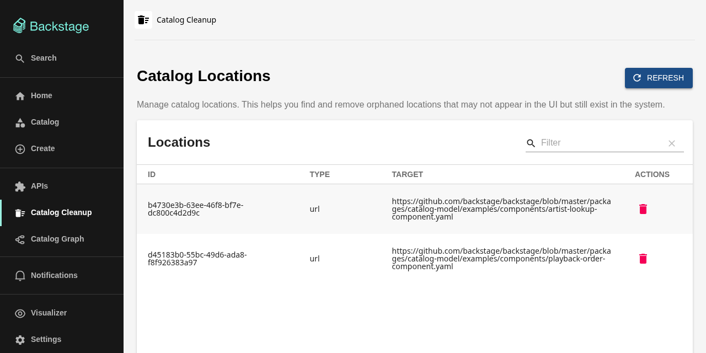

# Catalog Cleanup for Backstage

[](https://www.npmjs.com/package/@ruivalim/catalog-cleanup)
[](https://opensource.org/licenses/Apache-2.0)

A Backstage frontend plugin to list and delete the locations registered in the software catalog.



## The problem

You register a component and Backstage answers that the location already exists. You search the catalog UI and find nothing.

The location is still registered in the catalog API even though no entity from it shows up in the UI. Until now the fix was to do it by hand:

```bash
curl -s https://backstage.example.com/api/catalog/locations | jq
# ...find the id in a wall of JSON...
curl -X DELETE https://backstage.example.com/api/catalog/locations/507d46dd-ac5e-4152-8a4c-37eb8dfe3fcf
```

This plugin gives you a page with every registered location, search, and a delete button with confirmation.

## Installation

```bash
yarn --cwd packages/app add @ruivalim/catalog-cleanup
```

### New frontend system

If your app uses `createApp` from `@backstage/frontend-defaults` (what `@backstage/create-app` generates today) and has `app.packages: all` in `app-config.yaml`, installing the package is enough. The page is discovered automatically at `/catalog-cleanup` and gets an entry in the sidebar.

Without package discovery, add the plugin to your features:

```tsx
import catalogCleanupPlugin from '@ruivalim/catalog-cleanup/alpha';

export default createApp({
  features: [catalogCleanupPlugin /* , ...other features */],
});
```

The path can be changed in `app-config.yaml`:

```yaml
app:
  extensions:
    - page:catalog-cleanup:
        config:
          path: /admin/catalog-cleanup
```

### Legacy frontend system

Add the route in `packages/app/src/App.tsx`:

```tsx
import { CatalogCleanupPage } from '@ruivalim/catalog-cleanup';

// inside <FlatRoutes>
<Route path="/catalog-cleanup" element={<CatalogCleanupPage />} />
```

And optionally a sidebar item in `packages/app/src/components/Root/Root.tsx`:

```tsx
import DeleteSweepIcon from '@material-ui/icons/DeleteSweep';

<SidebarItem icon={DeleteSweepIcon} to="catalog-cleanup" text="Catalog Cleanup" />
```

## Permissions

The page talks to the catalog through the standard `CatalogApi`, so the catalog backend enforces its own permissions:

- `catalog.location.read` to list locations;
- `catalog.location.delete` to delete them. Without it the delete buttons are disabled.

Deleting a location orphans the entities that came only from it. With the default `catalog.orphanStrategy: delete` the catalog then removes them; with `keep` they stay, marked as orphans.

> The `catalogCleanupViewPermission` and `catalogCleanupDeletePermission` exports are deprecated. They were never checked by anything. Use the catalog permissions above in your policy instead.

## Requirements

- Tested on Backstage 1.55
- React 17 or 18

## Development

```bash
yarn install
yarn tsc
yarn lint
yarn test
yarn build
```

## License

Apache-2.0

## Author

[Rui Valim](https://github.com/Ruivalim)
